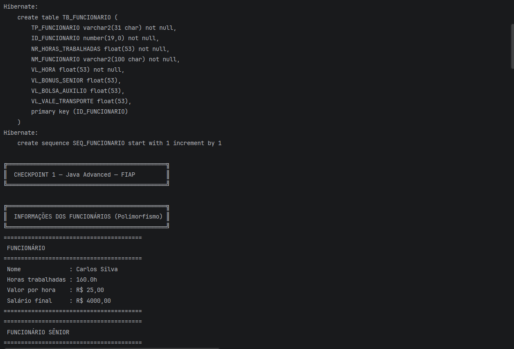
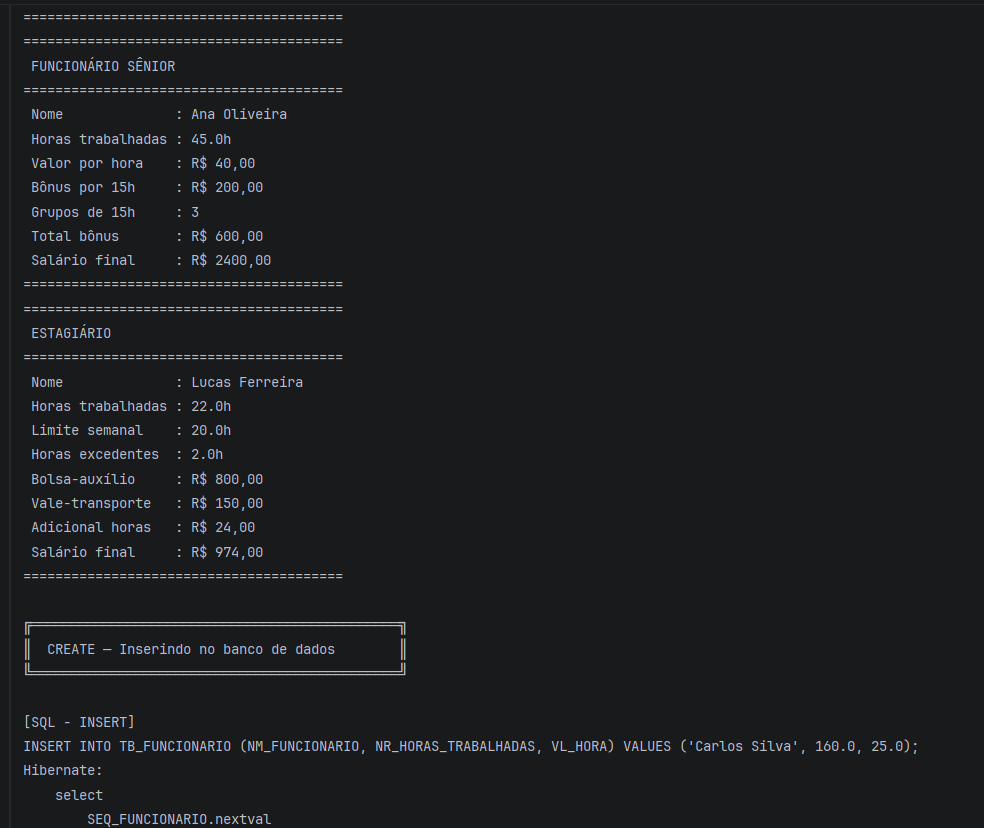
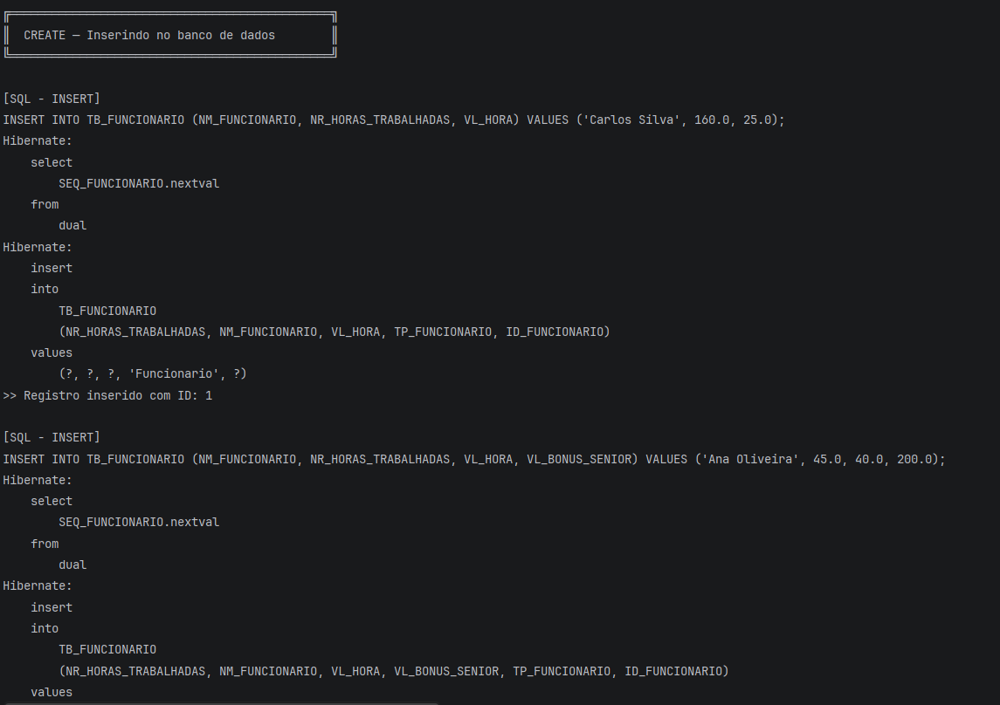
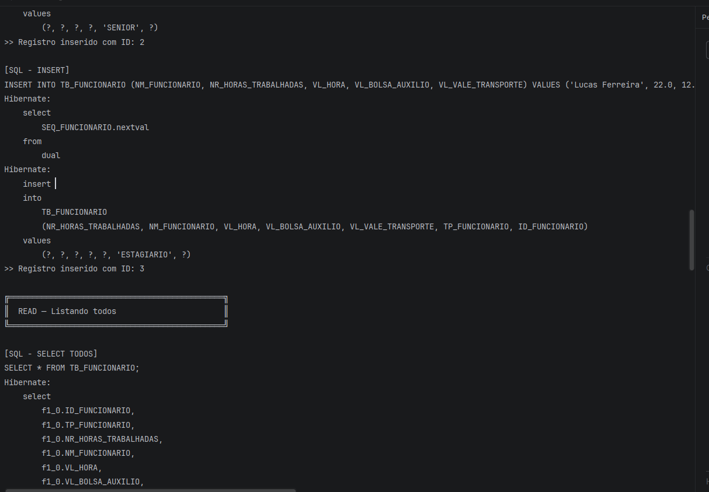
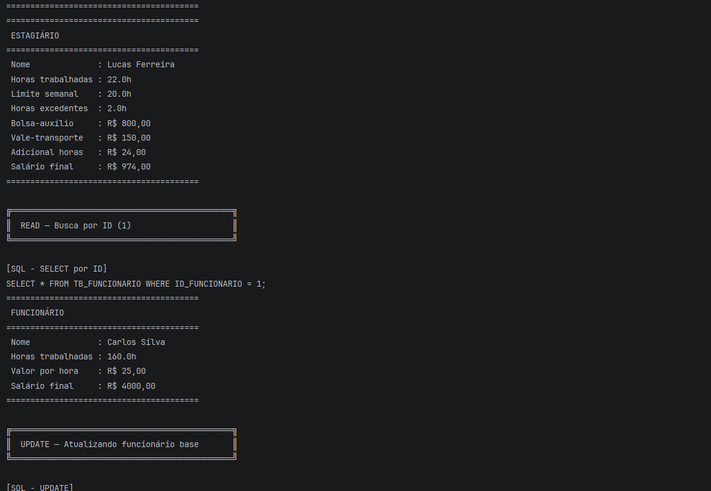
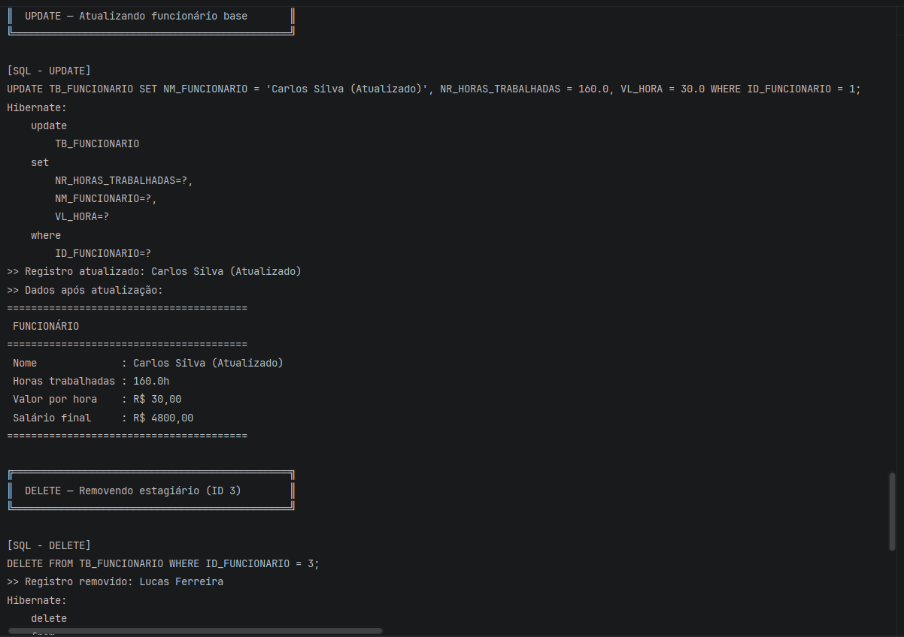
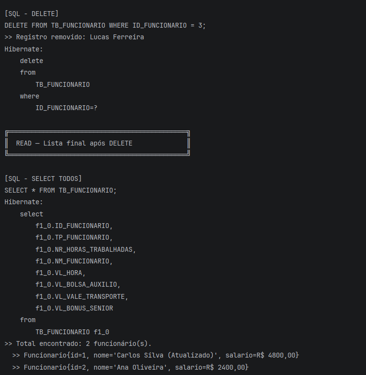
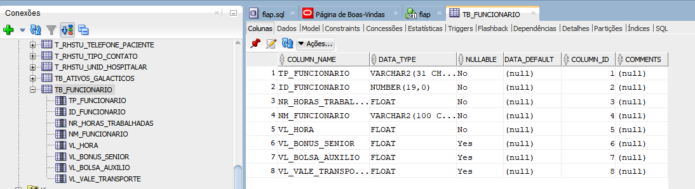

# Checkpoint 1 — Java Advanced — FIAP

## 📋 Descrição
Projeto do Checkpoint 1 da disciplina **Java Advanced** — 3º semestre ADS FIAP.
Demonstra **Herança**, **Polimorfismo**, **Anotações personalizadas**, **API Reflection**, **JPA/Hibernate** e **CRUD com Oracle SQL Developer**.

---

## 👥 Integrantes
| Nome | RM |
|Pedro Gabriel Claes Ferreira| rm566058 |
| Matheus Arazin | rm556649 |
| Arthur Pioli | rm565597 |
| Kevin Martins Campos | rm563454 |

---

## 🏗️ Estrutura do Projeto

```
checkpoint1/
├── pom.xml
└── src/main/
    ├── java/br/com/fiap/
    │   ├── annotations/
    │   │   ├── Descricao.java          ← @Descricao: nome da tabela no BD
    │   │   └── Coluna.java             ← @Coluna: nome/tipo de cada coluna
    │   ├── model/
    │   │   ├── Funcionario.java        ← Classe base (@Entity)
    │   │   ├── FuncionarioSenior.java  ← Bônus a cada 15h
    │   │   └── Estagiario.java         ← Bolsa + vale-transporte
    │   ├── repository/
    │   │   └── FuncionarioRepository.java  ← CRUD + SQL via Reflection
    │   └── main/
    │       └── Main.java               ← Testes do CRUD
    └── resources/META-INF/
        └── persistence.xml             ← JPA + Hibernate + Oracle
```

---

## 🗂️ Hierarquia de Classes

```
Funcionario          → salário = horas × valorHora
├── FuncionarioSenior → + bônus a cada 15h trabalhadas
└── Estagiario        → bolsa-auxílio + vale-transporte (+ adicional se > 20h/sem)
```

---

## 🗄️ Tabela no Oracle (SINGLE_TABLE)

| Coluna                  | Tipo          | Descrição                          |
|-------------------------|---------------|------------------------------------|
| ID_FUNCIONARIO          | NUMBER(10)    | PK — gerada por SEQ_FUNCIONARIO    |
| TP_FUNCIONARIO          | VARCHAR2(31)  | Tipo: BASE / SENIOR / ESTAGIARIO   |
| NM_FUNCIONARIO          | VARCHAR2(100) | Nome                               |
| NR_HORAS_TRABALHADAS    | NUMBER(10,2)  | Horas trabalhadas                  |
| VL_HORA                 | NUMBER(10,2)  | Valor por hora                     |
| VL_BONUS_SENIOR         | NUMBER(10,2)  | Bônus por 15h (Sênior)             |
| VL_BOLSA_AUXILIO        | NUMBER(10,2)  | Bolsa-auxílio (Estagiário)         |
| VL_VALE_TRANSPORTE      | NUMBER(10,2)  | Vale-transporte (Estagiário)       |

---

## ⚙️ Configuração

### 1. Driver Oracle
Baixe o `ojdbc11.jar` em https://www.oracle.com/database/technologies/appdev/jdbc-downloads.html
e instale no Maven local:
```bash
mvn install:install-file -Dfile=ojdbc11.jar \
    -DgroupId=com.oracle -DartifactId=ojdbc11 \
    -Dversion=23.3.0 -Dpackaging=jar
```

### 2. `persistence.xml`
Edite `src/main/resources/META-INF/persistence.xml` com suas credenciais:
```xml
<property name="jakarta.persistence.jdbc.url"
          value="jdbc:oracle:thin:@oracle.fiap.com.br:1521:ORCL"/>
<property name="jakarta.persistence.jdbc.user"     value="SEU_USUARIO"/>
<property name="jakarta.persistence.jdbc.password" value="SUA_SENHA"/>
```

### 3. Executar no IntelliJ
- Abra o projeto via **File → Open** (selecione a pasta `checkpoint1`)
- Aguarde o Maven baixar as dependências
- Execute a classe `br.com.fiap.main.Main`

---

## SQL

```sql
-- SELECT ALL
SELECT * FROM TB_FUNCIONARIO;

-- SELECT por ID
SELECT * FROM TB_FUNCIONARIO WHERE ID_FUNCIONARIO = 1;

-- INSERT (Funcionário base)
INSERT INTO TB_FUNCIONARIO (NM_FUNCIONARIO, NR_HORAS_TRABALHADAS, VL_HORA)
VALUES ('Carlos Silva', 160.0, 25.0);

-- UPDATE
UPDATE TB_FUNCIONARIO
SET NM_FUNCIONARIO = 'Carlos Silva (Atualizado)', VL_HORA = 30.0
WHERE ID_FUNCIONARIO = 1;

-- DELETE
DELETE FROM TB_FUNCIONARIO WHERE ID_FUNCIONARIO = 3;
```

---

## 📸 Evidências










